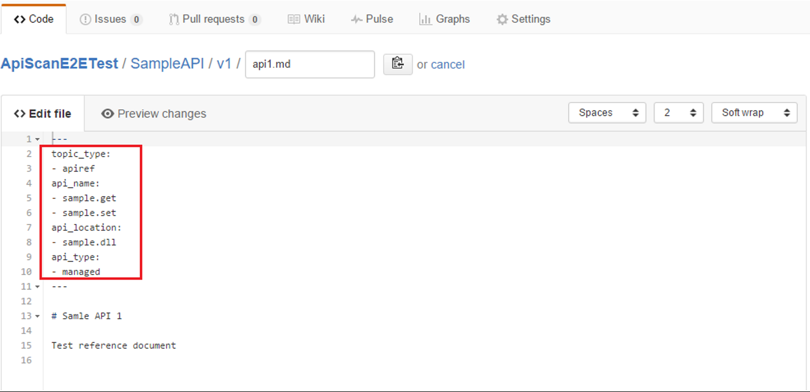
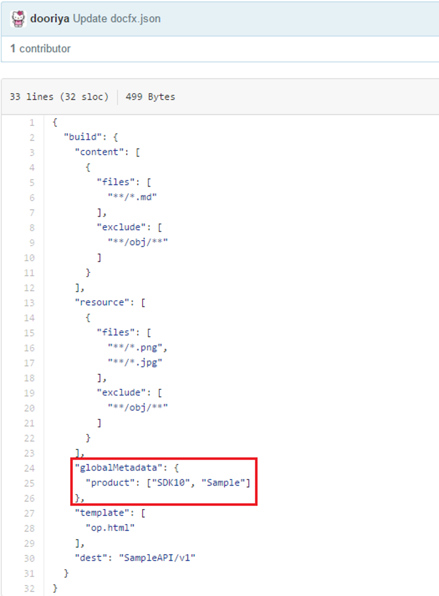

# API Scan

In order to make the reference document available for API Scan, content team needs to apply corresponding metadata to indicate that a document is one or more API, the name of the API, the type of the API, and the assembly name that contains the API.  Metadata will be published along with the document. OPS will extract API document with its API metadata in reporting database.  

## Configuring the docset for API Scan

If you do not have right to do this or need help, enter a request in [SiteHelp portal](http://aka.ms/sitehelp).

1. To enable API Scan for a docset, set the "API Scan" to "true" in the [OPS self-service portal](https://OPS). The default value of the option is false, which means it skips API Scan by default. 

2. Provide the product family of the docset in [OPS self-service portal](https://OPS), this is set to "product_family" metadata. 

## Metadata

1. Content owner needs to set up corresponding API metadata for an API document. For managed reference, it would be automatically added when generating the content out of the comments. For Unmanaged Reference, add API Scan related metadata for each API document in the YAML header. The API Scan related metadata includes: 

* product: multi-value, specified as a global metadata in docfx.json, thus all the documents in this DocSet will have same value of "product" metadata. 
* topic_type: multi-value, must have "apiref" as one of its values, otherwise this document will be skipped for API Scan. 
* api_name: multi-value, at least one value is specified 
* api_type: multi-value 
* api_location: multi-value 

2. In the doc.fx file, add global metadata "product" so it applies to all the docSet: 

