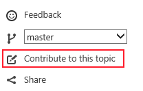

# Published content
The published pages with OP have the following features listed in this document.

## Publish content to MSDN and TechNet
Sample pages:
* [MSDN](https://msdn.microsoft.com/en-us/PowerShell/dsc/overview) 
* [TechNet](https://technet.microsoft.com/en-us/itpro/windows)
* [Visual Studio](https://www.visualstudio.com/en-us/docs/setup-admin/get-started)
* [Docs](https://docs.microsoft.com/en-us/rights-management/understand-explore/azure-rights-management) 

## Display content author, last updated time and contributors
Our pages now show at the top the author of the topic, the last updated date, and the contributions to the page. Clicking on the author or the contributors will take you to their Git profile. 

In some cases, there might be certain roles like repository maintainer and publisher, or engineering team members doing configuration work. Those accounts need to be removed from the contributor list on the page. OPS support metadata 'contributors_to_exclude' for you to filter them out. For example, Azure team uses 
```
"contributors_to_exclude": ["hexiaokai", "openpublishingbuild", "tysonn", "v-anpasi", "kiwhit", "ShawnJackson", "PRmerger", "DuncanmaMSFT", "Saisang", "Ja-Dunn", "jomolnar", "KatieCumming", "rjagiewich", "v-thepet", "deneha"]
```
The metadata could be applied in docfx.json as global metadata, or specifically configured on topic level, which will overwrite the global configuration for the specific file. 

## Contributions
If the repo is public and the contributions are enabled, you will see a contribute link on the top-right area of the page. Clicking will take to you to the Git repository. 



Note that for internal sites (like PPE) the button is always available as we want to encourage the internal users to contribute to the sites. 

Also, in internal sites you can select the branch you would like to render or contribute to.


## Ratings and Feedback for both MSDN and TechNet
When the user is in a page, a blue bar will appear at the bottom asking the user to rate the page. Once the Yes or No button is clicked, the user can provide some written feedback if they choose so.


