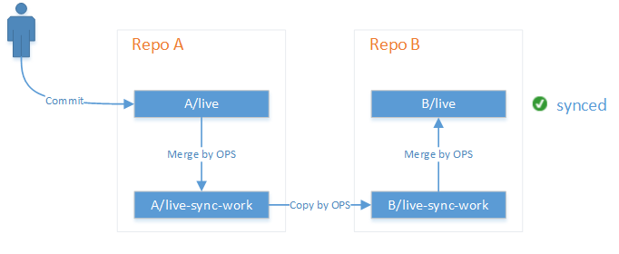
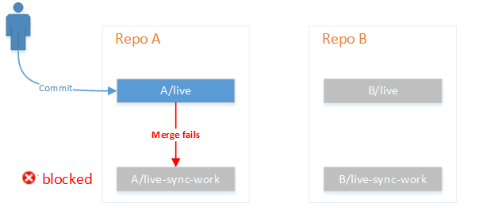
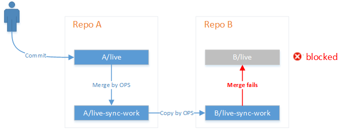

# Syncing between repos
This document describes scenario and design of syncing between repos in OPS.

## Scenario
1. User sets up a syncing pair between two repos.
2. OPS monitors the changes in either repo of the syncing pair and synchronize the changes to the other repo.
3. When OPS detects a conflict, a pull request is created for user to manually resolve the conflict.
4. OPS generates author, update time and contributor information based on commits in both repos.

## Syncing pair
A syncing pair consists of two repos. Each of the repos has a syncing branch to be in sync with the  other repo. For example, a syncing pair of Repo A and Repo B is set up on *master* branch of Repo A and *live* branch of Repo B.

## Provisioning
Users need to set up the configuration before OPS monitors the changes in a syncing pair. This process is called provisioning.

> Currently, we don't support provision of cross-repo syncing in [OPS self-service portal](https://OPS).
> Please enter a request in [SiteHelp portal](http://aka.ms/sitehelp) if you want to use this feature.

1. The URLs of Repo A and Repo B.

  > There is no limitation on public or private repository.

2. The syncing branch. 

  > By default, *live* branch of Repo A syncs with *live* branch of Repo B.

  > There is no limitation on the number of syncing pairs for a repository as long as the syncing branch and working branch are different from other pairs.

  > Working branch is created and maintained by OPS. It is branched from syncing branch and copied over between repos.

  > Working branch is mainly for resolving conflicts. User is not expected to push changes into working branch unless there is conflict to resolve.

  > OPS appends *-sync-work* to the name of syncing branch to generate the name for working branch. Example: if syncing branch of Repo A is *master*, its working branch would be *master-sync-work*.

3. Syncing strategy (whether to open pull request even there is no conflict)

  > By default, OPS pushes changes into syncing branch if there is no conflict.

  > Users can force a pull request to be opened even there is no conflict. An example is that when the syncing pair exists between a public repo and a private repo, the changes in public repo may need explicit user approval before synced into private repo.

  > Syncing strategy can be different in both ways (Repo A -> Repo B, and Repo B -> Repo A).

When receiving provisioning requests, OPS

1. Validates the request.

  a. Repo A and Repo B should exist.

  b. Syncing branch of Repo A and Repo B should exist.

  c. Working branch of Repo A and Repo B should not exist.

  d. There is no conflict with existing syncing pairs.

2. Writes the configuration into OPS internal DB.

3. Sets up webhook for both Repo A and Repo B.

4. Creates working branch for Repo A and Repo B.

5. Returns success.

## Syncing job
When syncing branch of either Repo A or Repo B changes, OPS gets notified by GIT webhook and a syncing job is created.

Syncing jobs of a syncing pair are queued. In any time, there is at most one syncing job regarding the syncing pair being processed by OPS backend.

The syncing status of a syncing pair is one of the followings:

  + **synced**: means syncing branch of A is up-to-date with syncing branch of B and vice versa.
  
  + **processing**: means a syncing job between A and B is in processing.
  
  + **blocked**: means there is a conflict and requires user intervention. OPS would open a pull request whenever a conflict is detected. When the syncing status is blocked, any further syncing jobs will only be queued. Users need to manually close the pull request to resume the processing of the queue.

Similar to publish job, when enabled, users are able to see the status of a syncing job, and the latest syncing status of a syncing pair in [OPS self-service portal](https://OPS).

## Syncing algorithm
Suppose we are syncing between Repo A syncing branch *live* and Repo B syncing branch *live*. The working branches are A/live-sync-work and B/live-sync-work, respectively.

The following diagram shows the relationship between repos and branches.

Syncing algorithm triggered by user commit:

1. Before processing (status: **synced**)
A/live-sync-work and B/live-sync-work are last synced snapshots. The files in A/live-sync-work and B/live-sync-work are same.

2. Processing  (status: **processing**)
  
  1) When user commits a change into A/live, OPS merges the change to A/live-sync-work.
     
    - If mergeable and user does not require manual intervention, continue.
     
    - If not mergeable or user requires manual intervention, open a pull request from A/live to A/live-sync-work, set status to **blocked** and quit.
  
      
  
  2) OPS clean copies A/live-sync-work to B/live-sync-work. This step always succeeds without conflicts.
  
  3) OPS merges B/live-sync-work into B/live.
  
    - If mergeable and user does not require manual intervention, continue.
     
    - If user requires or not mergeable, open a pull request from A/live to A/live-sync-work, set status to **blocked** and quit.
    
      
  
3. After processing (status: either **synced** or **blocked**)
  - If **synced**, A/live-sync-work and B/live-sync-work are now snapshots with user's change.

  - If **blocked**, OPS monitors the status of the pull request. The syncing resumes when the pull request is closed.

We will describe the processing without conflicts and with conflicts in details below.

## Processing without conflicts
Suppose at some time, the syncing status of pair A/live and B/live is **synced** (both HEAD in commit id C0).

  ~~~
  A/live (C0) = A/live-sync-work (C0) = B/live-sync-work (C0) = B/live (C0)
  ~~~

Now, some one pushes change (commit C1) into A/live.

  ~~~
  A/live (C1) ? A/live-sync-work (C0) = B/live-sync-work (C0) = B/live (C0)
  ~~~

A syncing job is queued when OPS receives the notification from GIT. OPS processes the syncing job following below steps.

1. Pull C1 from remote A/live to local working directory.

2. Merge local A/live (C1) to local A/live-sync-work (C0) and local A/live-sync-work is with HEAD C1.

3. Push local A/live-sync-work (C1) to remote.

  ~~~
  A/live (C1) = A/live-sync-work (C1) ? B/live-sync-work (C0) = B/live (C0)
  ~~~

4. Clean copy local A/live-sync-work (C1) to local B/live-sync-work (C1).

5. Push local B/live-sync-work (C1) to remote. Now remote B/live-sync-work is with HEAD C1.

  ~~~
  A/live (C1) = A/live-sync-work (C1) = B/live-sync-work (C1) ? B/live (C0)
  ~~~

6. Merge remote B/live-sync-work (C1) to remote B/live (C0)
  Depending on syncing strategy, the merge can be done automatically or via pull request to involve user intervention or approval.

  6a. Merge by pull request
  If user needs manual approval of the merge, a pull request from B/live-sync-work to B/live will be opened. The syncing status of the pair would change to **blocked**.
  
  ~~~
  A/live (C1) = A/live-sync-work (C1) = B/live-sync-work (C1) -- pull request --> B/live (C0)
  ~~~
  
  User should review the pull request and merge the pull request. When the pull request gets merged, B/live is with HEAD C1 and in sync with A/live. Then, the syncing status of the pair is changed to **synced**.

  ~~~
  A/live (C1) = A/live-sync-work (C1) = B/live-sync-work (C1) = B/live (C1)
  ~~~

If user closes the pull request without merging, the remote B/live is still not up-to-date with B/live-sync-work. OPS detects this difference and the pull request would be opened again.

  6b. Automatic merge
  Otherwise, the merge would be done automatically: Merge local B/live-sync-work to local B/live, and push local B/live to remote. Now remote B/live is in sync with A/live.
  
  ~~~
  A/live (C1) = A/live-sync-work (C1) = B/live-sync-work (C1) = B/live (C1)
  ~~~

## Detecting and resolving conflicts
There could be conflicts in either target repo or source repo.

### Conflict in target repo (Repo B)
Suppose the working branches are in sync as shown in [Step 1](#Step1). The processing goes on well without conflict until [Step 6](#Step6).

In [Step 6b](#Step6b), when OPS tries merging local B/live-sync-work (C1) to local B/live, there will be conflict if remote B/live is already with HEAD commit C2. This happens when some one else makes the changes into remote B/live before the syncing job gets processed.

  ~~~
  remote A/live (C1) = remote A/live-sync-work (C1) = remote B/live-sync-work (C1) ? remote B/live (C2)
          |                    |                              |                              | --> CONFLICT
   local A/live (C1) -> local A/live-sync-work (C1) -> local B/live-sync-work (C1) -> local B/live (C1)
  ~~~

In this case, a pull request will be opened to merge from remote B/live-sync-work to remote B/live. The syncing status of the pair is now **blocked**.

The opened pull request will show as not mergeable. User needs to manually fix the conflict using GIT commands. Normally, the fix is done by first merging B/live (C2) into B/live-sync-work (C1), resolving any conflicts, and pushing the changes to B/live-sync-work with HEAD commit (C1'+C2). After pushing, the pull request will be marked as mergeable and can be closed merging into B/live.

After the conflicts get resolved and pull request merged, the remote B/live-sync-work would be with HEAD (C1'+C2).

  ~~~
  remote A/live (C1) = remote A/live-sync-work (C1) ? remote B/live-sync-work (C1'+C2) = remote B/live (C1'+C2)
  ~~~

Note now the working branches are not in sync. OPS would first clean copy B/live-sync-work into A/live-sync-work and push A/live-sync-work to remote. The working branches restore into sync status.

  ~~~
  remote A/live (C1) ? remote A/live-sync-work (C1'+C2) = remote B/live-sync-work (C1'+C2) = remote B/live (C1'+C2)
  ~~~ 

Then OPS clears the syncing status of **blocked** and resumes processing of other syncing jobs of the pair (there should have at least one syncing job triggered by B/live in the queue).

### Conflict in source repo (Repo A)
Similarly, conflicts could happen in [Step 3](#Step3) when OPS tries to apply the change in A/live to remote A/live-sync-work. This could happen in some rare cases when OPS picks up a syncing job from A to B after user just merges changes in B (as shown above).

  ~~~
  remote A/live (C3)       ?      remote A/live-sync-work (C4) = remote B/live-sync-work (C4) = remote B/live (C4)
          |
   local A/live (C3) --CONFLICT--> local A/live-sync-work (C4)
  ~~~

If a conflict is detected between A/live and A/live-sync-work, a pull request will be opened. User needs to manually fix the conflict and merge the change into A/live-sync-work. After the pull request is merged, the remote A/live-sync-work would be with HEAD C3'+C4.

  ~~~
  remote A/live (C3'+C4) = remote A/live-sync-work (C3'+C4) ? remote B/live-sync-work (C4) = remote B/live (C4)
  ~~~

OPS would first clean copy A/live-sync-work to B/live-sync-work and push the change to remote B/live-sync-work.

  ~~~
  remote A/live (C3'+C4) = remote A/live-sync-work (C3'+C4) = remote B/live-sync-work (C3'+C4) ? remote B/live (C4)
  ~~~

Then, the processing of the queue will be resumed.

## Metadata based on GIT history information
GIT history information is lost when syncing between repos.

For metadata based on GIT history information, OPS will maintain an internal DB to combine information from both repos and use the DB to generate them. These metadata include:
  + author
  + update time
  + contributor information
